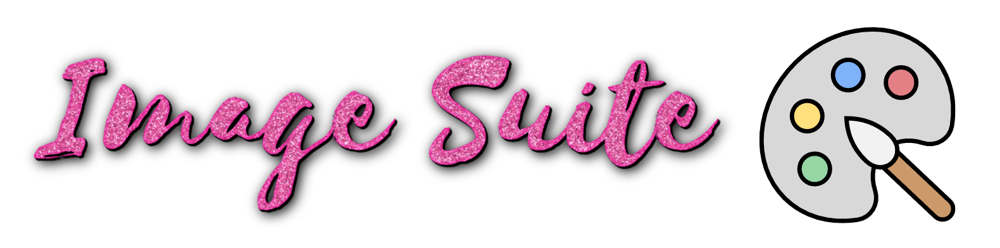

<p align="center">
  
</p>

<h1 align="center">Image Suite</h1>
<p align="center"><em>A multi-page image workbench, as a Wan2GP plugin.</em></p>

<p align="center">🎉 <strong>Now an official Wan2GP plugin</strong> — install it straight from the Wan2GP <strong>Plugin Manager</strong>.</p>

> ### ⚠️ Still a young release
> **Expect the occasional quirk.** If something misbehaves, please
> [**open an issue**](https://github.com/saintorphan/ImageSuite-Wan2GP/issues) and
> I'll squash it ASAP.

Image Suite drops a single gold-bordered **Image Suite** tab into Wan2GP with three
generation pages — **Txt2Img**, **Img2Img** and **MultiCanvas** — a **Modify** image
editor, an **Overlays** library and a **⚙ Settings** tab. A header bar lets you **save
and load whole Projects** — your entire workspace — at any time.

## ✨ Highlights

### 🧠 Every image model, one dropdown
- **Native Wan2GP models** — **Flux**, **Z-Image** and **Qwen**, run straight
  through Wan2GP's own task queue.
- **The full SDXL family** — **SDXL, Pony, Illustrious** and friends, which Wan2GP
  has *no* native support for. Image Suite brings them in **fully integrated**
  via a self-contained diffusers backend (bundled — no external setup), pickable
  from the same categorized model dropdown — LoRAs and all.

### 🎨 MultiCanvas — layered drawing, masking & inpainting
A proper PaintShop-style canvas, not a single mask box:
- **Layers** — stacked draw layers over your image, with a horizontal layers
  manager (add / delete / hide / reorder / flip).
- **Mask tools** — auto-mask, magic wand, lasso, grow / shrink, invert, blur.
- **Draw tools** — brush (with hardness), eraser, a **restore brush** (paint
  erased pixels back), fill bucket, eyedropper, clone stamp, smudge, and
  rectangle / ellipse / line shapes.
- **Clipboard & transform** — copy/paste masked regions as new layers; an
  on-canvas **transform tool with drag handles** (move / scale / rotate) plus
  per-layer opacity; flatten down.
- **Overlays** — keep a library of transparent PNGs / frames / stickers and
  **drag them straight onto the canvas** as new layers.
- **Complex inpainting** — mask mode, masked-content fill, inpaint area and
  padding, plus **outpaint** to extend the image outward and let the model paint
  in the new edges.
- **Collapsible tool rail** — fold the tool panel away (`»`) for a full-width canvas,
  and bring it back (`«`) when you need it.

### 🖌 Modify — quick image editor
A no-model editing page for any result or uploaded image:
- **Crop** with aspect presets (Free / 1:1 / 4:3 / 3:4 / 16:9 / 9:16), drag handles
  and rule-of-thirds guides.
- **Resize output** — export at a target resolution independent of the crop (e.g. crop
  a 1:1 region and emit it at 1024×1024), with presets, W×H and aspect lock.
- **Flip** horizontal / vertical, plus zoom & pan.
- **Colour correction** — brightness / contrast / saturation / hue / warmth, live.
- **Colour match** — transfer a reference image's palette (LAB mean/std) onto your edit.
- Save the edit to results, then send it anywhere.

### 🎬 Send anywhere — Img2Vid, other tabs & plugins
Plant **any** result straight into Wan2GP's video generator as an img2vid **init or end**
image — image to video without leaving the app. Bounce a result between the four pages,
or **Save As**. With the companion **SendTo** plugin installed, a unified **Send to**
picker on every tab also routes results — and whole **video clips** from the gallery — to
other OrphanSuite plugins like **Reel2Reel**.

### 🧑‍🎨 Face & body swap + post-processing
A built-in enhancement suite you can run on any result: **ADetailer** face & body
refine, **face swap**, **body swap** (transfers skin tone & texture, head
preserved), and a **color / style reference** pass.

### 🗂️ Prompt Library, presets & tagging
- **Prompt Library** — save a full setup (prompt, negative, **every** generation
  setting, model, LoRAs and post-process options) under a name and reload it on any
  tab. One shared, reusable collection across Txt2Img / Img2Img / MultiCanvas.
- **Resolution presets + aspect lock** — a per-model dropdown of that family's
  trained buckets (1:1 / portrait / landscape) that fills Width × Height in a click,
  plus a 🔒 **lock** so dragging one dimension scales the other to keep the ratio.
- **Interrogate** — pull a prompt back *out* of any image (WD14 booru tags, or a
  BLIP caption) to remix or refine it.

### 💾 Projects — save & restore your whole workspace
Save everything you're working on as a named **Project** from the header bar: all
three tabs' prompts and settings, the reference images, the results you currently have
on screen, and the **entire MultiCanvas layer stack** (base + every layer + mask). Load
it back any time to pick up exactly where you left off. A **Flush Outputs** button in
Settings reclaims disk from old generations that aren't part of a project — and shows
you how much space it'll free first.

### 🔗 Part of OrphanSuite — shared across my plugins
Image Suite is one of the **OrphanSuite** plugins (alongside **Reel2Reel**,
**Replicant CharLab** and the **SendTo** router — not all released yet), which share
setup so you configure things once:

- **Unified config** — SDXL/Pony/Illustrious checkpoints, LoRAs and face/ADetailer
  weights live in a single shared `.orphansuite.json`. Set a folder once (in *any*
  OrphanSuite plugin's **Settings → OrphanSuite**) and every plugin uses it — no
  per-plugin duplication.
- **Link existing folder** — a button in **Settings → OrphanSuite** that
  **symlinks** models you already keep (a1111 / Forge / anywhere on disk) into the
  shared area, without copying or moving the originals.
- **Shared right-click menu** — right-click **any image** in Wan2GP for an
  **OrphanSuite** section (*Open / Save / Copy* plus *Send to Img2Vid*,
  *ImageSuite (Img2Img)*, *ImageSuite (MultiCanvas)*, *ImageSuite (Modify)*); it loads
  straight into the right page. A **Settings toggle** limits it to Image Suite's own images if you'd rather keep
  Wan2GP's native right-click everywhere else (applied live, no reload). As the other
  plugins land they register their own surfaces into the *same* shared menu, so
  everything cross-talks.

## Install
Use the Wan2GP **Plugin Manager → Add from GitHub URL**:
```
https://github.com/saintorphan/ImageSuite-Wan2GP
```
or clone into `Wan2GP/plugins/ImageSuite-Wan2GP`.

The **native** (Flux / Z-Image / Qwen) path works out of the box. The
**SDXL-family** backend and the enhancement suite (face/body swap, ADetailer,
interrogate) need a few extra Python packages — 🤗 `diffusers`, `transformers`
and friends. From your Wan2GP root, grab them with:
```bash
pip install -r plugins/ImageSuite-Wan2GP/requirements.txt
```
Everything's lazily imported, so the plugin still loads and the native path still
works even before you install them.

### Getting models
The **SDXL family** (SDXL / Pony / Illustrious) isn't bundled — point Image Suite at
checkpoints + LoRAs you already have in **Settings → OrphanSuite**, or use the
**Link existing folder** button to symlink an existing a1111 / Forge / drive folder
in without copying. Native **Flux / Z-Image / Qwen** weights download like any other
Wan2GP model. The helper weights for **face / body swap, ADetailer and BiRefNet**
segmentation are fetched **on demand** from the models panel in **⚙ Settings** —
nothing downloads until you ask. Output folders, model directories and the low-VRAM
model filter live there too.

## Where this came from
These features started life in my own AI frontend, **SupremeDiffusion** — but
they're **bundled right into this plugin** (the SDXL backend, the swaps, all of it
run from its own `core/` code via 🤗 diffusers). **You do not need SupremeDiffusion,
or any other external repo, installed** — just this plugin. Since SupremeDiffusion
already builds on part of Wan2GP's video pipeline, porting a few favourites back as
Wan2GP plugins is my way of giving something back; Image Suite is the first.

Huge thanks to **deepbeepmeep** and **[Wan2GP](https://github.com/deepbeepmeep/Wan2GP)**
for the platform. 💛

## License
Image Suite is released under the **same license as Wan2GP — the WanGP Community
License 2.0** (see [`LICENSE.txt`](LICENSE.txt)): free for personal, hobby, research
and internal/business use, including using its outputs commercially. Bundled
third-party code keeps its own license — see
[`THIRD_PARTY_NOTICES.md`](THIRD_PARTY_NOTICES.md) (notably the Apache-2.0
Laplacian-blend port).
